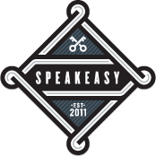

<!SLIDE bullets incremental>
# You have completed RailsBridge #102!
* Congratulations!

<!SLIDE bullets>
# Please thank our awesome sponsors!
* John Palmer 
* Ahren Ewbank

<!SLIDE bullets>
# Celebrate!
* After-party 

<!SLIDE bullets>
# What did we learn?
* Ruby as a language
* Rails as a framework
* MVC design pattern

<!SLIDE bullets>
# Resources:
* http://installfest.railsbridge.org/workshop/resources
* http://pinterest.com/pvnrtmol/ruby-and-rails-resources/
* http://pinterest.com/eanakashima/learn-the-front-end/
* Follow-up:
* Indy.rb — a fine group of Ruby enthusiasts from around the Indianapolis area, or pretty much wherever they feel like driving from. Our group meets on the second Wednesday of each month at 7 PM http://indyrb.org/
* RailsBridge IRC channel
* DevChix E-mail list http://www.devchix.com/
* Systers mailing list
* Want to organize a workshop? join railsbridge-workshops@googlegroups.com

<!SLIDE bullets>
# RIGHT NOW
* TAKE THIS SURVEY RIGHT NOW: http://bit.ly/183NiG9
